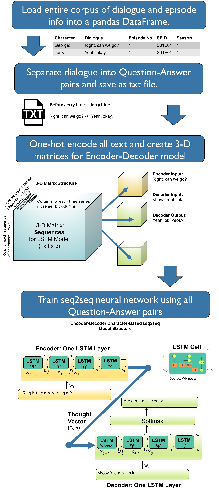

# Seinfeld Neural seq2seq Chatbot
Final Capstone Project for Galvanize Data Science Immersive 

by Matt Devor

## Table of Contents
- [Introduction](#introduction)
- [Objectives](#objectives)
- [Data](#data)
- [Processs Flow](#processs-flow)
- [Results](#results)
- [Conclusion](#conclusion)
- [Next Steps](#next-steps)

# Introduction
I’ve been a Seinfeld fan since the early 90’s, so when I discovered a database of episode scripts, I thought that would be a great opportunity to explore the corpus of dialogue, and learn much more about NLP, recurrent neural networks, and chatbots in the process.

Note that the initial part of this project, containing all EDA, topic modeling, sentiment analysis, and initial text generation attempts can be found [here](https://github.com/MattD82/dsi_capstone_2).

As such, I will not be spending as much time in this README discussing those elements of the analysis.

[Back to Top](#Table-of-Contents)

# Objectives
- Use EDA to completely understand the corpus of dialogue and episode information.
- Create a character-based sequence to sequence (seq2seq) LSTM (Long Short-Term Memory) recurrent neural network using dialogue from the dataset to create a chatbot that speaks like Jerry Seinfeld.
_ Deploy a Flask app that allows users to have a conversation with the Jerry chatbot.

[Back to Top](#Table-of-Contents)

# Data
- 56,000 lines of dialogue in the series.
- ~14,500 lines spoken by Jerry.
- 1,600 different characters have dialogue in the series, but Jerry, George, Elaine, and Kramer have the bulk of the lines.


Figure 1. Lines Spoken per Character – All Seasons

[Back to Top](#Table-of-Contents)

# Processs Flow



[Back to Top](#Table-of-Contents)

# Results
- The final seq2seq model has a train accuracy of 53% after 100 epochs, and a validation accuracy of 22%.
- While these values may seem low, it is notoriously difficult to evaluate text generation models, as we don’t necessarily want the output to be deterministic.
- As with any neural network, more data would be needed to allow the model to generalize well.

### Other examples of funny/interesting conversations I've had with the Jerry Bot:
```
You: Stay with me here.
Jerry: Oh!
You: Ok. Now. Where were we?
Jerry: Aw, we can't do it, who are we kidding.
You: Talk?
Jerry: Yeah.
You: Why not?
Jerry: You know its not like that.

Jerry: Boy, you got a lot of stuff here.
You: on the computer?
Jerry: What?
You: You live in the computer!
Jerry: Yeah.
You: Do you get lonely?
Jerry: I don't know. 

You: How are you?
Jerry: Good, good.
You: Can I be your friend?
Jerry: Hey, it's the Kman. 

You: I'm tired. 
Jerry: Alright, that's right.
You: Are you?
Jerry: I can't believe it.
You: Do you get tired?
Jerry: I don't know.
You: Cause you're a bot!
Jerry: Oh, Elaine. 

You: I'm DONE with this BOT!
Jerry: Hey, look at this guy!
```

[Back to Top](#Table-of-Contents)

# Conclusion
A model incorporating a seq2seq LSTM was able to learn the speech patterns of Jerry Seinfeld relatively well, but it is far from perfect.
As we can see, the model is responding using correct punctuation and sentence structure, for the most part.  

A few things that could potentially help any seq2seq model improve are:
- More data – helps the model generalize well in that it will respond intelligently to unseen questions.
- Additional LSTM layers – allows model to learn longer sequences

Other applications for seq2seq models include:
- Machine translation
- Image Captioning
- Text summarization

[Back to Top](#Table-of-Contents)

# Next Steps
- Word-based model using BERT word embedding vectors.
- Continue refining model architecture and incorporate attention mechanisms.
- Create George, Elaine, and Kramer chatbots and have them interact.

[Back to Top](#Table-of-Contents)


